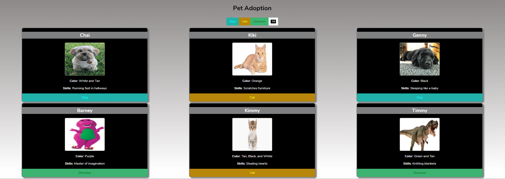

# Pet-Adoption

## Description
This project allows the user to find pets that are avialble for adoption. It gives the user the color of the pet and the type of pet.  The user can also find a pet by sorting through the different types of pet at the top of the page.
## Screenshots

## How to Run
1. Clone down this repo
1. Make sure you have  http-serve installed via npm. If not, get it [HERE](https://npmjs.com/package/http-server).
1. On your command line run `hs -p 9999`
1. In your browser go to `http://localhost:9999`